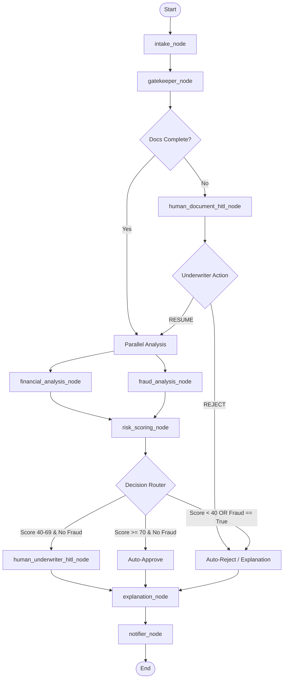

# LoanShield — Master Skills & Architecture Specification (skills.md)
# ⚠ Definitive Source of Truth for Implementation. Do NOT alter.
# ─────────────────────────────────────────────────────────────────────────────

This document defines the complete architecture, data models, agent behaviors, routing rules, and mathematical logic for the LoanShield automated and secure lending decision platform.

═══════════════════════════════════════════════════════════════════════════════
1. PROJECT GOALS & OBJECTIVES
═══════════════════════════════════════════════════════════════════════════════

The primary objective of LoanShield is to ingest credit applications, securely redact PII, run parallel financial analysis and fraud detection via Model Context Protocol (MCP) servers, score the credit risk using a multi-factor risk engine, route the applications to appropriate decision boundaries (Auto-Approve, Human Review, Auto-Reject), and notify the user with ECOA-aligned explanation letters.

═══════════════════════════════════════════════════════════════════════════════
2. REPOSITORY & FOLDER STRUCTURE
═══════════════════════════════════════════════════════════════════════════════

The repository must follow this structure exactly:

```
loanshield/
├── pyproject.toml                  # Pinned dependencies
├── Makefile                        # Dev commands: install, test, playground, run
├── Dockerfile                      # Deployment container config
├── docker-compose.yml              # Local container execution
├── .env.example                    # Template for env variables
├── .gitignore                      # Ignore credentials, caches, envs
├── README.md                       # High-level developer documentation
├── SUBMISSION_WRITEUP.md           # Submission details
├── DEMO_SCRIPT.txt                 # Presentation narration script
│
├── loanshield/                     # Main python source folder
│   ├── __init__.py
│   ├── agent.py                    # LangGraph definition and agents
│   ├── config.py                   # Global configuration loading
│   ├── mcp_server.py               # Combined stdio MCP servers for mock services
│   ├── state.py                    # Typed state models and schemas
│   └── skills/                     # Modular business logic functions
│       ├── __init__.py
│       ├── pii_redactor.py
│       ├── income_verify.py
│       ├── dti_calculator.py
│       ├── stability_modifier.py
│       ├── risk_scoring.py
│       ├── fraud_detection.py
│       └── explanation.py
│
├── datasets/                       # Reference datasets
│   ├── banking_mcp_final.csv
│   ├── credit_bureau_mcp_final.csv
│   ├── document_storage_mcp_final.json
│   ├── employment_mcp_final.csv
│   └── main_applications_final.csv
│
└── tests/                          # Automated tests
    ├── __init__.py
    ├── test_skills.py              # Unit tests for scoring, redact, etc.
    ├── test_mcp.py                 # MCP server mock integration tests
    └── test_graph.py               # Graph integration tests for all 54 rows
```

═══════════════════════════════════════════════════════════════════════════════
3. CODING STANDARDS & PYTHON ENVIRONMENT
═══════════════════════════════════════════════════════════════════════════════

- **Python Version**: 3.12 (standard typing, generic types)
- **Frameworks**: Python ADK 2.0 (LangGraph, Pydantic v2, FastAPI)
- **Code Style**: SOLID design principles, clean separation of concerns, strictly typed variables using Pydantic, Ruff/Black for formatting.

═══════════════════════════════════════════════════════════════════════════════
4. DETAILED GRAPH STATE SCHEMA (state.py)
═══════════════════════════════════════════════════════════════════════════════

The graph state represents the single source of truth throughout execution.

```python
from typing import TypedDict, List, Dict, Any, Optional
from pydantic import BaseModel, Field

class VerifiedFile(BaseModel):
    type: str
    status: str
    extracted_name: Optional[str] = None
    extracted_employer: Optional[str] = None
    statement_period_days: Optional[int] = None

class DocumentStatus(BaseModel):
    customer_id: str
    document_vault_status: str  # "COMPLETE" or "INCOMPLETE"
    verified_files: List[VerifiedFile]
    missing_requirements: List[str]

class CreditBureauProfile(BaseModel):
    customer_id: str
    credit_score: int
    credit_history_length_months: int
    delinquencies: int
    total_tradelines: int
    monthly_debt_obligations: float

class BankingProfile(BaseModel):
    customer_id: str
    average_monthly_deposits: float
    average_monthly_withdrawals: float
    current_balance: float

class EmploymentProfile(BaseModel):
    customer_id: str
    employer_name: str
    employment_status: str  # "Active", "Terminated", etc.
    tenure_months: int

class AuditEvent(BaseModel):
    timestamp: str
    node_name: str
    severity: str  # "INFO", "WARNING", "CRITICAL"
    message: str
    details: Dict[str, Any]

class LoanApplicationState(TypedDict):
    # Raw Inputs
    applicant_id: str
    customer_id: str
    name: str
    ssn: str
    dob: str
    phone_number: str
    home_address: str
    age: int
    declared_income_monthly: float
    loan_amount: float
    purpose: str
    target_scenario: str

    # Redacted Fields (PII safe zone)
    redacted_name: str
    redacted_ssn: str
    redacted_dob: str
    redacted_phone_number: str
    redacted_home_address: str

    # MCP Fetched States
    documents: Optional[DocumentStatus]
    credit_profile: Optional[CreditBureauProfile]
    banking_profile: Optional[BankingProfile]
    employment_profile: Optional[EmploymentProfile]

    # Flags & Scoring
    fraud_flag: bool
    fraud_reasons: List[str]
    income_variance_pct: float
    calculated_dti: float
    credit_score_component: float
    dti_component: float
    cash_flow_component: float
    stability_modifier: float
    composite_score: float

    # Audit & Decisions
    decision: str  # "AUTO_APPROVE", "HUMAN_REVIEW", "AUTO_REJECT"
    underwriter_override: Optional[str]  # "APPROVE", "REJECT", None
    eco_letter: str
    audit_trail: List[AuditEvent]
    errors: List[str]
```

═══════════════════════════════════════════════════════════════════════════════
5. MULTI-AGENT DESIGN & RESPONSIBILITIES
═══════════════════════════════════════════════════════════════════════════════

1. **Orchestrator Agent**:
   - Manages state progression, triggers parallel fan-out of analysis nodes, joins outputs, and checks decisions.
2. **Gatekeeper Agent**:
   - Responsible for PII masking (redacting SSN, DOB, Phone, Address) via regex and LLM checks.
   - Pulls document vault completeness status using the Document Storage MCP. If status is `INCOMPLETE`, halts flow with an `interrupt()` to await Human Document HITL review.
3. **Financial Analyst Agent**:
   - Queries Credit Bureau, Banking, and Employment MCP servers.
   - Invokes `income_verify_skill` to compute deposit averages, detect monthly deposit variances, and compare declared vs bank-verified incomes.
   - Invokes `dti_calculator_skill` to compute Debt-To-Income ratios.
   - Determines employment tenure details and calculates stability modifiers.
4. **Fraud & Compliance Agent**:
   - Evaluates deterministic compliance rules (Synthetic credit age anomaly, underage credit volume, termination status check).
   - Sets `fraud_flag` to `True` if any compliance limits are violated.
5. **Risk Scorer Agent**:
   - Aggregates the credit component, DTI component, cash flow component, and employment stability modifiers.
   - Applies the mathematical formula to generate the final composite score.
6. **Explanations Agent**:
   - Uses the final decision state and score components to generate a regulatory ECOA-compliant notice letter utilizing LLM structuring.

═══════════════════════════════════════════════════════════════════════════════
6. DETAILED MATHEMATHICAL RISK FORMULAS
═══════════════════════════════════════════════════════════════════════════════

All risk metrics are computed deterministically. The final score ranges between 0 and 100.

### 6a. Credit Component ($S_{\text{Credit}}$) - 40% Weight
- **Base Score**: Scale the FICO Score ($F$) linearly between 300 and 850:
  $$S_{\text{Credit\_Base}} = \frac{F - 300}{550} \times 100$$
- **Delinquency Penalty**: Apply a penalty of $-20$ points for each delinquency ($D$) record on the bureau:
  $$S_{\text{Credit}} = \max(0, S_{\text{Credit\_Base}} - (20 \times D))$$

### 6b. Debt-to-Income Component ($S_{\text{DTI}}$) - 30% Weight
- Calculated as:
  $$\text{DTI} = \frac{\text{Monthly Debt Obligations}}{\text{Bank-Verified Monthly Income}}$$
  - **Scoring Grid**:
    - $\text{DTI} \le 0.30 \implies S_{\text{DTI}} = 100$
    - $0.30 < \text{DTI} \le 0.45 \implies S_{\text{DTI}} = 60$
    - $0.45 < \text{DTI} \le 0.55 \implies S_{\text{DTI}} = 30$
    - $\text{DTI} > 0.55 \implies S_{\text{DTI}} = 0$

### 6c. Cash Flow Component ($S_{\text{CashFlow}}$) - 30% Weight
Split into two sub-metrics (max 50 points each):
1. **Savings Buffer (Max 50 Points)**:
   - Measures liquidity buffer relative to the loan request amount:
     - If $\text{Current Balance} \ge 2 \times \text{Loan Amount} \implies S_{\text{Buffer}} = 50$
     - Else:
       $$S_{\text{Buffer}} = \left( \frac{\text{Current Balance}}{2 \times \text{Loan Amount}} \right) \times 50$$
2. **Burn Rate (Max 50 Points)**:
   - Measures income surplus vs spending:
     - If $\text{Average Monthly Deposits} > \text{Average Monthly Withdrawals} \implies S_{\text{Burn}} = 50$
     - Else $\implies S_{\text{Burn}} = 0$
- **Total Cash Flow Component**:
  $$S_{\text{CashFlow}} = S_{\text{Buffer}} + S_{\text{Burn}}$$

### 6d. Base Composite Score ($S_{\text{Base}}$)
$$S_{\text{Base}} = (S_{\text{Credit}} \times 0.40) + (S_{\text{DTI}} \times 0.30) + (S_{\text{CashFlow}} \times 0.30)$$

### 6e. Employment Stability Modifier ($\alpha$)
Tenure modifiers are applied directly to the base composite score:
- Tenure $< 6$ months $\implies \alpha = 0.85$ (15% Probationary penalty)
- $6 \le \text{Tenure} \le 24$ months $\implies \alpha = 1.00$ (Neutral)
- Tenure $> 24$ months $\implies \alpha = 1.05$ (5% Career stability bonus)

### 6f. Risk-Adjusted Composite Score
$$\text{Final Score} = \min(100, S_{\text{Base}} \times \alpha)$$

*Note: If the Fraud flag is active, composite score calculation is bypassed, routing application instantly to Auto-Reject.*

═══════════════════════════════════════════════════════════════════════════════
7. LANGGRAPH WORKFLOW ROUTING LOGIC
═══════════════════════════════════════════════════════════════════════════════



### Routing Rules (LangGraph conditional edges)
- **Score $\ge 70$ & no Fraud** $\implies$ Route to **Auto-Approve** (runs explanation node).
- **Score $40 - 69$ & no Fraud** $\implies$ Route to **human_underwriter_hitl_node** (interrupts execution).
- **Score $< 40$ OR Fraud Flag is True** $\implies$ Route to **Auto-Reject** (runs explanation node).

*Verification Gate: Adhere to EDGE RULE. Never duplicate edges between matching source-target nodes. Use unconditional transitions once routes converge.*

═══════════════════════════════════════════════════════════════════════════════
8. MODULAR BUSINESS SKILLS
═══════════════════════════════════════════════════════════════════════════════

1. **pii_redactor_skill**:
   - Regex matches for Name (capitalized structures), SSN (`\b\d{3}-\d{2}-\d{4}\b`), DOB, Phone (`\b\d{3}-\d{3}-\d{4}\b` or negative CSV indices), and Address lines.
   - LLM fallback for validating semantic patterns and masking them with token replacements (e.g. `[REDACTED_SSN]`).
2. **income_verify_skill**:
   - Computes rolling deposit averages over 3 months from Banking MCP.
   - Detects if `declared_income_monthly > 2 * average_deposits` $\implies$ sets `fraud_flag = True`.
3. **dti_calculator_skill**:
   - Formula: `monthly_debt_obligations / average_deposits`.
   - Returns a structured DTI score and component score.
4. **stability_modifier**:
   - Calculates the tenure multiplier ($\alpha$) based on tenure months.
5. **fraud_detection_skill**:
   - Age check: `age < 21` and `loan_amount > 100000` $\implies$ fraud.
   - Short credit file: `credit_history_length_months < 6` and `credit_score > 780` $\implies$ fraud.
   - Employment check: `employment_status == "Terminated"` $\implies$ fraud.
6. **risk_scoring_skill**:
   - Executes FICO scaling, cash flow savings metric, deposit spending metrics, DTI scaling, and tenure modifier calculations.
7. **explanation_skill**:
   - Drafts ECOA-compliant notices citing component factors (e.g. "Low debt ratio", "Short employment tenure").

═══════════════════════════════════════════════════════════════════════════════
9. MODEL CONTEXT PROTOCOL (MCP) SERVERS
═══════════════════════════════════════════════════════════════════════════════

All MCP servers run as stdio servers, mocked inside `mcp_server.py`. They parse corresponding CSV/JSON datasets relative to the `customer_id` parameter.

1. **DocVerificationServer**:
   - Reads `document_storage_mcp_final.json`. Exposes `get_document_status(customer_id)`.
2. **CreditBureauServer**:
   - Reads `credit_bureau_mcp_final.csv`. Exposes `get_credit_profile(customer_id)`.
3. **BankingServer**:
   - Reads `banking_mcp_final.csv`. Exposes `get_banking_profile(customer_id)`.
4. **EmploymentServer**:
   - Reads `employment_mcp_final.csv`. Exposes `get_employment_profile(customer_id)`.
5. **NotificationServer**:
   - Simulates Slack webhook triggers or SMTP email dispatches for finalized decisions.

═══════════════════════════════════════════════════════════════════════════════
10. OBSERVABILITY & AUDIT LOGGER
═══════════════════════════════════════════════════════════════════════════════

- Every node transition must append an `AuditEvent` containing a structured JSON map, correlation ID (based on application ID), node identifier, severity rating, and descriptive detail.
- If a fraud rule triggers, write a `WARNING` or `CRITICAL` log detailing the specific rule matched.
- Export OpenTelemetry metrics tracking overall processing duration and routing results.

═══════════════════════════════════════════════════════════════════════════════
11. ACCEPTANCE CRITERIA & INTEGRATION MATRIX
═══════════════════════════════════════════════════════════════════════════════

When execution is validated, the pipeline must process all 54+ dataset records matching these exact decisions:
- **Rows 1 - 15**: Auto-Approved. Composite scores $\ge 70$, zero fraud flags.
- **Rows 16 - 30**: Human Review / Escalation. Scores land in the $40 - 69$ range.
- **Rows 31 - 40**: Auto-Rejected. High DTI ($>40\%$), scores $< 40$.
- **Rows 41 - 46**: Auto-Rejected. Triggered fraud signals (large loans under 21, synthetic identity matches, income mismatches).
- **Rows 47 - 50**: Document completeness interrupt. Halt flow waiting for Underwriter manual resume/reject commands.
- **Rows 51 - 54**: Hard Auto-Rejected. Terminated employment profiles, bypassing all calculations.
